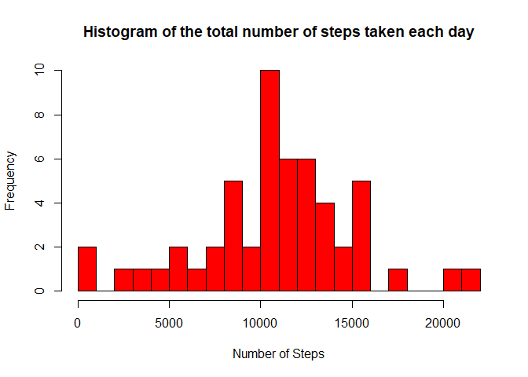
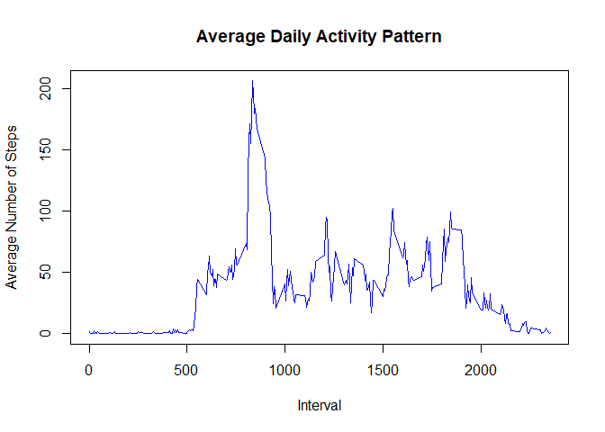
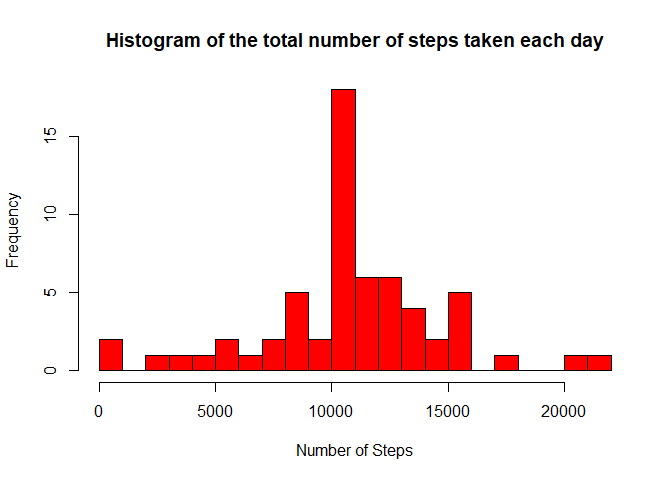
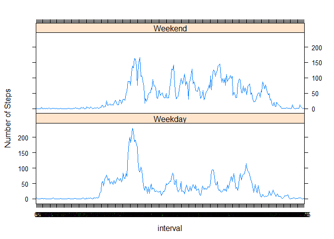

## Loading and preprocessing the data
Reading the data from the “activity.csv”


```r
data <- read.csv("activity.csv", header = TRUE, sep = ",", na.strings = "NA")
```
Looking at a summary for the dataset using “summary” and “str” methods:

```r
summary(data)
```

```
##      steps            date              interval     
##  Min.   :  0.00   Length:17568       Min.   :   0.0  
##  1st Qu.:  0.00   Class :character   1st Qu.: 588.8  
##  Median :  0.00   Mode  :character   Median :1177.5  
##  Mean   : 37.38                      Mean   :1177.5  
##  3rd Qu.: 12.00                      3rd Qu.:1766.2  
##  Max.   :806.00                      Max.   :2355.0  
##  NA's   :2304
```

```r
str(data)
```

```
## 'data.frame':	17568 obs. of  3 variables:
##  $ steps   : int  NA NA NA NA NA NA NA NA NA NA ...
##  $ date    : chr  "2012-10-01" "2012-10-01" "2012-10-01" "2012-10-01" ...
##  $ interval: int  0 5 10 15 20 25 30 35 40 45 ...
```
Looking at the first 6 rows of the dataset:


```r
head(data)
```

```
##   steps       date interval
## 1    NA 2012-10-01        0
## 2    NA 2012-10-01        5
## 3    NA 2012-10-01       10
## 4    NA 2012-10-01       15
## 5    NA 2012-10-01       20
## 6    NA 2012-10-01       25
```
Converting the “date” variable to a Date classe and the “interval” variable to a factor:


```r
data$date <- as.Date(data$date, format = "%Y-%m-%d")
data$interval <- factor(data$interval)
```

## What is mean total number of steps taken per day?

Subsitting the dataset to ignore missing values


```r
NA_index <- is.na(as.character(data$steps))
data_no_NA <- data[!NA_index,]
head(data_no_NA)
```

```
##     steps       date interval
## 289     0 2012-10-02        0
## 290     0 2012-10-02        5
## 291     0 2012-10-02       10
## 292     0 2012-10-02       15
## 293     0 2012-10-02       20
## 294     0 2012-10-02       25
```

Aggregating the number of steps taken each day:

Creating a data frame with the steps taken for each day

```r
steps_each_day <- aggregate(steps ~ date, data = data_no_NA, sum)
```

Adding column names to the created data frame

```r
colnames(steps_each_day) <- c("date", "steps")
```

Making a histogram of the total number of steps taken each day:

```r
hist(as.numeric(steps_each_day$steps), breaks = 20, col = "red", xlab = "Number of Steps", main= "Histogram of the total number of steps taken each day")
```

<!-- -->

number of steps taken per day:

```r
#Mean
mean(steps_each_day$steps)
```

```
## [1] 10766.19
```

```r
#Median
median(steps_each_day$steps)
```

```
## [1] 10765
```

## What is the average daily activity pattern?

Calculating the average number of steps taken, averaged across all days:

Calculating the average

```r
steps_per_interval <- aggregate(data_no_NA$steps, by=list(interval=data_no_NA$interval), FUN=mean)
```
Adding columns names

```r
colnames(steps_per_interval) <- c("interval", "average_steps")
```
ploting the average daily activity pattern 

```r
plot(as.integer(levels(steps_per_interval$interval)), steps_per_interval$average_steps, type="l",
     xlab = "Interval", ylab = "Average Number of Steps", main = "Average Daily Activity Pattern",  col ="blue")
```

<!-- -->
The 5-minute interval that contains the maximum number of steps:

The maximum number of average steps

```r
max_steps <- max(steps_per_interval$average_steps)
max_steps
```

```
## [1] 206.1698
```
The 5-minute interval that contains the maximum number of steps

```r
intervale_max_steps<-steps_per_interval[which.max(steps_per_interval$average_steps),]$interval
intervale_max_steps
```

```
## [1] 835
## 288 Levels: 0 5 10 15 20 25 30 35 40 45 50 55 100 105 110 115 120 125 ... 2355
```
So, the 5-minute interval that contains the maximum number of steps ( 206.2 steps ) is the interval 835.

## Imputing missing values

The total number of missing values in the dataset (for each variable):

For the “steps” variable:

```r
sum(is.na(as.character(data$steps)))
```

```
## [1] 2304
```
For the “date” variable:

```r
sum(is.na(as.character(data$date)))
```

```
## [1] 0
```

For the “interval” variable:

```r
sum(is.na(as.character(data$interval)))
```

```
## [1] 0
```
So, the total number of missing values in the dataset is 2304.

The strategy for filling in all of the missing values in the dataset. Missing values are replaced by the mean of that 5-minute interval.

finding the indices of missing values (NAs)


```r
NA_index <- which(is.na(as.character(data$steps)))
complete_data <- data
```
Imputing missing values using the mean for that 5-minute interval

```r
complete_data[NA_index, ]$steps<-unlist(lapply(NA_index, FUN=function(NA_index){
                steps_per_interval[data[NA_index,]$interval==steps_per_interval$interval,]$average_steps
                }))
```
Creating a new dataset that is equal to the original dataset but with the missing data filled in.

Checking the complete data with the summary and str methods

```r
summary(complete_data)
```

```
##      steps             date               interval    
##  Min.   :  0.00   Min.   :2012-10-01   0      :   61  
##  1st Qu.:  0.00   1st Qu.:2012-10-16   5      :   61  
##  Median :  0.00   Median :2012-10-31   10     :   61  
##  Mean   : 37.38   Mean   :2012-10-31   15     :   61  
##  3rd Qu.: 27.00   3rd Qu.:2012-11-15   20     :   61  
##  Max.   :806.00   Max.   :2012-11-30   25     :   61  
##                                        (Other):17202
```

```r
str(complete_data)
```

```
## 'data.frame':	17568 obs. of  3 variables:
##  $ steps   : num  1.717 0.3396 0.1321 0.1509 0.0755 ...
##  $ date    : Date, format: "2012-10-01" "2012-10-01" ...
##  $ interval: Factor w/ 288 levels "0","5","10","15",..: 1 2 3 4 5 6 7 8 9 10 ...
```
Making a histogram of the total number of steps taken each day for the complete dataset:

Creating a data frame with the steps taken for each day

```r
steps_each_day_complete <- aggregate(steps ~ date, data = complete_data, sum)
```

Adding column names to the created data frame

```r
colnames(steps_each_day_complete) <- c("date", "steps")
```


Making the histogram

```r
hist(as.numeric(steps_each_day_complete$steps), breaks = 20, col = "red", xlab = "Number of Steps", main= "Histogram of the total number of steps taken each day")
```

<!-- -->


Calculating the mean and median total number of steps taken per day for the complete dataset:

```r
#Mean
mean(steps_each_day_complete$steps)
```

```
## [1] 10766.19
```

```r
#Median
median(steps_each_day_complete$steps)
```

```
## [1] 10766.19
```
We notice that the mean of the complete dataset (10766) is equal to the mean of the dataset without missing values. The median of the complete dataset has shifted from 10765 to 10766. Therefore, the mean and median for the complete dataset are almost identical.

## Are there differences in activity patterns between weekdays and weekends?

Creating a factor variable "day "to store the day of the week:

```r
complete_data$day <- as.factor(weekdays(complete_data$date))
```
Creating a logical variable "is_weekday" (weekday=TRUE, weekend = FALE) :

```r
complete_data$is_weekday <- ifelse(!(complete_data$day %in% c("Saturday","Sunday")), TRUE, FALSE)
```

Calculating the average number of steps for weekdays

```r
weekdays_data <- complete_data[complete_data$is_weekday,]
steps_per_interval_weekdays <- aggregate(weekdays_data$steps, by=list(interval=weekdays_data$interval), FUN=mean)
```

Calculating the average number of steps for weekends

```r
weekends_data <- complete_data[!complete_data$is_weekday,]
steps_per_interval_weekends <- aggregate(weekends_data$steps, by=list(interval=weekends_data$interval), FUN=mean)
```


Adding columns names

```r
colnames(steps_per_interval_weekdays) <- c("interval", "average_steps")
colnames(steps_per_interval_weekends) <- c("interval", "average_steps")
```

Adding a column to indecate the day

```r
steps_per_interval_weekdays$day <- "Weekday"
steps_per_interval_weekends$day <- "Weekend"
```


Merging the two togather

```r
week_data <- rbind(steps_per_interval_weekends, steps_per_interval_weekdays)
```


Converting the day variabke to a factor

```r
week_data$day <- as.factor(week_data$day)
```

Making the plot

```r
library(lattice)
xyplot(average_steps ~  interval | day, data = week_data, layout = c(1,2), type ="l", ylab="Number of Steps")
```

<!-- -->

